# Up and Running with Lacework and Jenkins
This repo contains a tutorial for how Lacework customers can integrate the Lacework container vulnerability capability with Jenkins to test container build for vulnerabilities.

## What we are going to build
Before we begin it is important to understand the high level workflow here. We are going to spin up Jenkins pipeline that connects to Github and builds a Docker image from a Dockerfile, publishes the image to Docker Hub, and then initiates a container vulnerability scan of that image using the Lacework command line interface image.

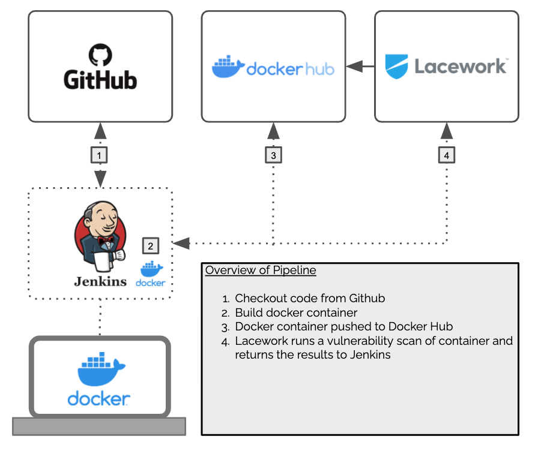

_We’ll use Docker to provision Jenkins locally and connect to GitHub, Docker Hub, and Lacework!_

### No access to Jenkins?
No need to worry about installing and configuring Jenkins, we’ve got you covered there as well. This repo contains a docker-compose file to provision Jenkins using Docker locally, and after applying a few configurations we will be good to go!

### Prerequisites
To run this tutorial you should feel comfortable on the command line and have some very basic understanding of both Git, GitHub, and Docker. Additionally, there are a few items you’ll need to installed and at the ready:

- [A Lacework Account](https://lacework.com)
- [Docker Desktop](https://www.docker.com/products/docker-desktop)
- [Docker Hub Account](https://hub.docker.com/signup)

Once you have the prereqs checked off you are good to go and we can get started!

Fork and Clone the Repository

The first thing you will want to do is to fork this repo to your own Github account, and then clone it to your workstation with Git and Docker Desktop installed.

```bash
$ git clone https://github.com/<YOUR USERNAME>/jenkins-lacework-tutorial.git

$ cd jenkins-lacework-tutorial
```

## Lacework API Token
In order to authenticate with Lacework and request on demand container vulnerability scans we will need to have an API key and secret. 

1. Login to your Lacework Account
2. Click on Settings and choose API Keys
3. Click *"Create New"*
4. Give your API token a _Name_ and optionally a _Description_
5. Click the *Download* link on the right next to the *ENABELED* switch and save the file locally as we will need it to configure Jenkins

The contents of your API key contain a “keyId” and “secret” and will look something like this...

```json
{
  "keyId": "ACCOUNT_86858622520DB3B8E6C171247820FA724CDDB19DDDDDDD",
  "secret": "_412a4c080e5c8a2e069a4144444444444"
}
```
## Jenkins with docker-compose

The root of the jenkins-lacework-tutorial contains a docker-compose.yml file that we can use to bring up a test environment comprised of a docker network, two docker volumes, Jenkins running in a docker container, and a Docker in Docker (dind) container to run our build jobs.

### docker-compose up
Make sure you are in the root directory of the project we cloned above and execute the following command:

```bash
$ docker-compose -p lacework up -d
Creating network "lacework_jenkins" with the default driver
Creating volume "lacework_jenkins-docker-certs" with default driver
Creating volume "lacework_jenkins-data" with default driver
Creating lacework_jenkins_1     ... done
Creating lacework_docker-dind_1 ... done
```

When Jenkins starts up the first time, it automatically creates an Administrator password that we will need to log in. We can get that password by running the following command:

```bash
$ docker exec lacework_jenkins_1 cat /var/jenkins_home/secrets/initialAdminPassword

2f8b8d35d6fd41f9804a6de40a4b847e
```

Copy that password, open an web browser and go to [http://localhost:8080](http://localhost:8080)

### Jenkins Initial Setup
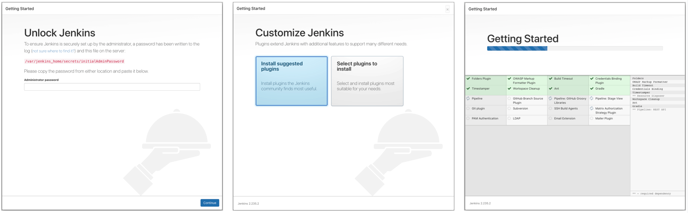

1. Paste the Administrator password and click **“Continue”**
2. Choose **"Install suggested plugins"**

Installing plugins will take a minute or so depending on your network connection.

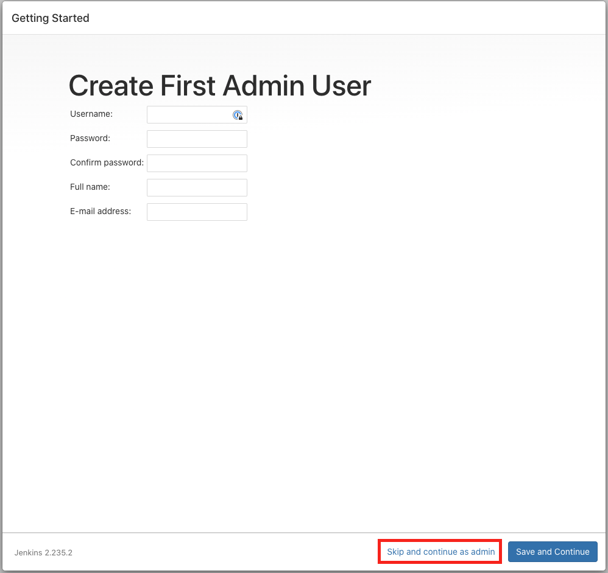

After the plugins are installed you have the option to create an Admin User, or you can just use the default Administrator, go ahead and click **“Skip and continue as admin”**, then click **"Save and finish"**

After that you can just click **"Restart"** to finish the initial setup. _(Note: you may need to refresh your browser to get Jenkins to reload)_

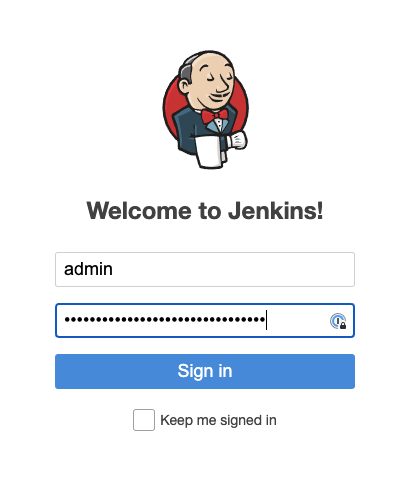

Once Jenkins restarts you can login with `admin/<admin password>`

### Install Docker Pipeline Plugin

You will need to install **Docker Pipeline** plugin. This plugin allows you to build, test, and use Docker images from Jenkins Pipeline project. Go to the [Manage Jenkins Plugins](http://localhost:8080/pluginManager/) page, search for Docker Pipeline plugin under the **Available**, click the checkbox adjancent to Docker pipeline plugin, and finally click on the **Download now and install after restart** button.

## Configuring Jenkins
With Jenkins running locally we are ready to configure the pipeline. The repository that you cloned has a Jenkinsfile that already defines the pipeline we are going to run. That Jenkinsfile makes use of both Environment Variables and Secret Credentials that we will need to set up before configuring the job. Let’s get those going...

### Environment Variables
We are going to define three global environments variables. Those variables are as follows:

- `LW_ACCOUNT` = The name of your Lacework account
- `LW_API_KEY` = This can be found in the JSON file we downloaded earlier
- `DOCKER_HUB` = The username for your Docker Hub account. We will use this to publish docker image we build to Docker Hub

_NOTE: Environment variable names are case sensitive_

You can jump straight to Manage Jenkins / Configure System by clicking [here](http://localhost:8080/configure) or by opening a browser and going to http://localhost:8080/configure

1. Scroll down to Global Properties 
2. Check the box next to Environment Variables, and add the three environment variables as follows:

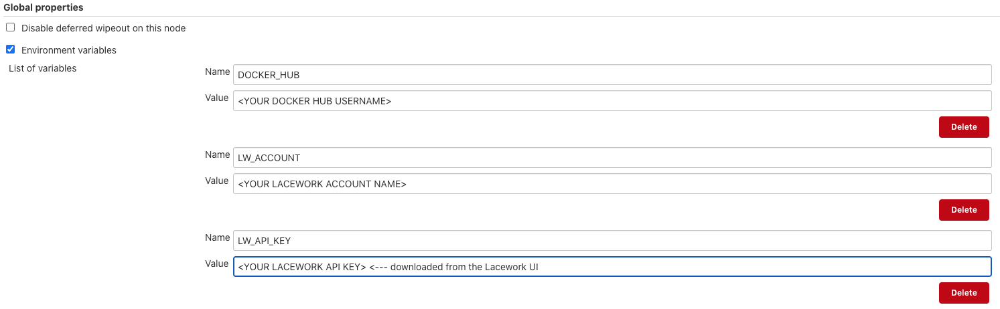

### Credentials
You will need to add your username and password for Docker Hub, as well as another type of credential Jenkins refers to as a **Secret Text** for your Lacework API Secret. You can jump right to that configuration page by clicking [here](http://localhost:8080/credentials/store/system/domain/_/newCredentials).

#### Docker Hub Credentials
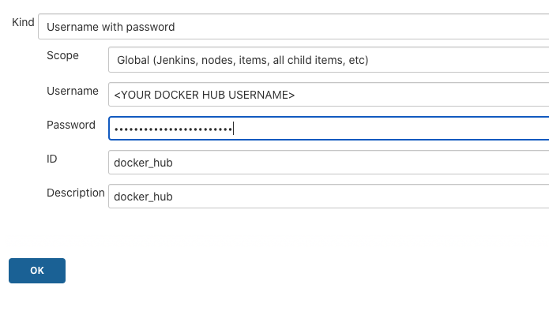

Add your Docker Hub Credentials as follows and use the ID `‘docker_hub’` as that is how it is referred to in the [`Jenkinsfile`](https://github.com/scottford-lw/jenkins-lacework-tutorial/blob/master/Jenkinsfile#L23)

Click **"OK"**

#### Lacework API Secret
Next, on the left click **"Add Credentials"** and add the following credential:

- Kind: Secret Text
- Scope: Global
- Secret: <Paste your Lacework API Secret from the downloaded JSON>
- ID: lacework_api_secret
- Description: lacework_api_secret

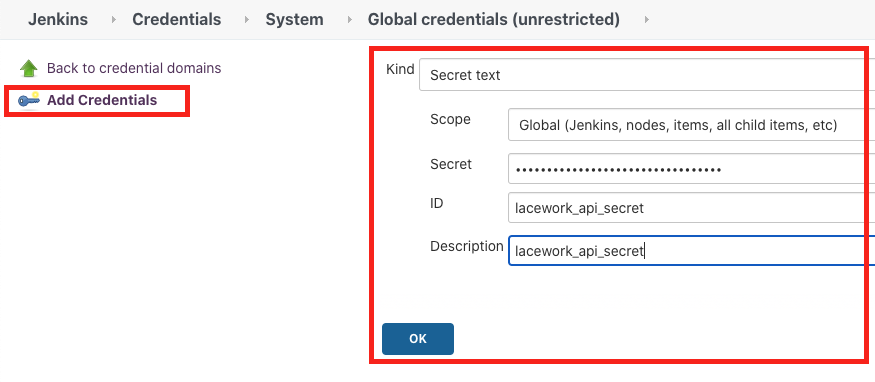

At this point you should see the two credentials stored in Jenkins:
 
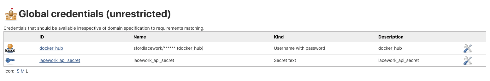

We are now ready to move on to configuring the pipeline.

## Create Pipeline with Blue Ocean
The version of Jenkins we used with our Docker container has a user interface called Blue Ocean installed that makes it really easy to create new pipelines. There is a ton of documentation on Blue Ocean if you want to learn more, but for now let’s get going…

On the left hand side click **"Open Blue Ocean"**

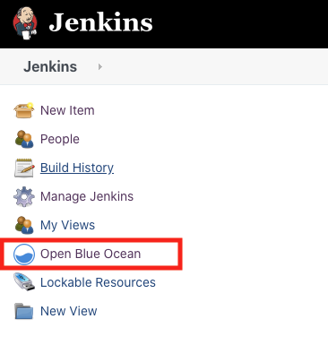

Next click **“Create New Pipeline”**

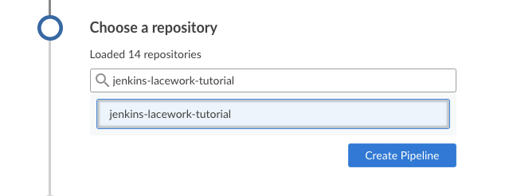

When asked where you store your code choose **GitHub**

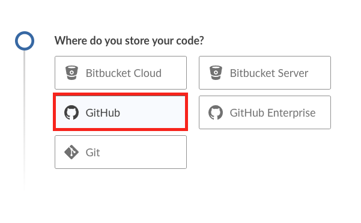

Next we need to allow Jenkins to monitor our repo for changes and for that we are going to need to create GitHub Personal Access Token. Click on **“Create an access token here.”**

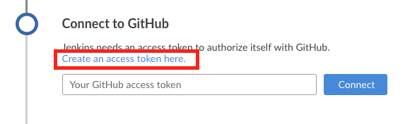

You will be redirected to login to GitHub and immediately taken to the Personal Access Token generation page. Give you token a name that you’ll remember (you can delete after if you wish), and then click **Generate Token**
 
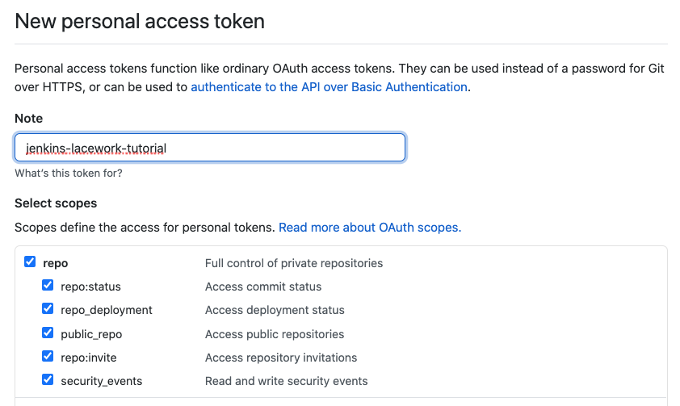

You can now copy the token to your clipboard and paste it back in Jenkins

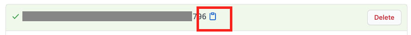

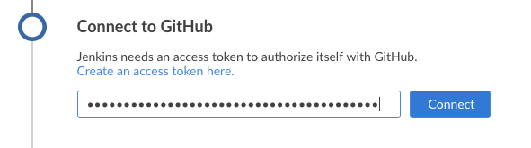

Once authenticated you should be able to navigate any of the Github Orgs you have access to so you can select the location where you forked the example Git repo at the beginning of the tutorial. 

Select the `jenkins-lacework-tutorial` and then click **"Create Pipeline"**

At this point Jenkins will find the `Jenkinsfile` in the root of the repository and kick off the pipeline. 

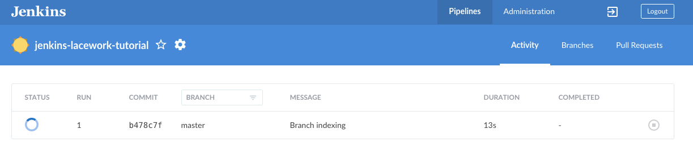

You can click on the pipeline to watch the build, publish and finally the scan from Lacework!


The output here shows a human readable summary of the vulnerabilities found. If no vulnerabilities are found the output will reflect that as well. There is actually a ton of data that comes back via this API call, and we are really just scratching the surface. For more information on the Lacework CLI and what you can do with it click [here](https://github.com/lacework/go-sdk/wiki/CLI-Documentation).

## Spinning Jenkins Down
Once you are ready to tear down the test environment you have two options. 

### Save the state
If you are going to continue to play around with Jenkins as it is configured and want to save the state you can run the following command:

```bash
$ docker-compose -p lacework down
```

When you are ready to continue your work you just run:

```bash
$ docker-compose -p lacework up -d
```

### Delete State 
If you want to complete tear down Jenkins and remove the docker volumes and network, run the following command:

```bash
$ docker-compose -p lacework down --volumes
```